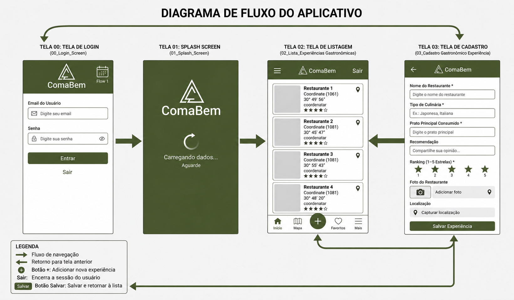

# 🍽️ ComaBem - Gestão de Experiências Gastronômicas

O **ComaBem** é um aplicativo mobile desenvolvido em **Flutter** para registro e gerenciamento de experiências gastronômicas pessoais. O aplicativo permite que os usuários cadastrem avaliações de restaurantes, pratos, notas (ranking), localização via GPS e registros fotográficos.

---

## 📱 Wireframe e Fluxo de Telas

O aplicativo é composto por 4 telas principais baseadas no wireframe do projeto:

1. **Tela 00 - Login (`00_Login_Screen`):** Autenticação do usuário.
2. **Tela 01 - Splash Screen (`01_Splash_Screen`):** Tela de carregamento/boas-vindas.
3. **Tela 02 - Listagem (`02_Lista_Experiencias`):** Exibição das experiências cadastradas pelo usuário.
4. **Tela 03 - Cadastro (`03_Cadastro_Experiencia`):** Formulário completo com captura de foto, localização GPS e avaliação.



---

## 🛠️ Tecnologias Utilizadas

- **Linguagem:** Dart
- **Framework:** Flutter
- **Banco de Dados Local:** SQLite (`sqflite`, `path`)
- **Recursos Nativos:**
    - Geolocalização (`geolocator`)
    - Câmera e Galeria (`image_picker`)
- **Testes:** Unitários com `flutter_test`

---

## 🗃️ Estrutura do Banco de Dados Local (SQLite)

O banco de dados relacional local (`comabem.db`) é estruturado em duas tabelas:
- **`usuarios`**: Tabela responsável pelo armazenamento de credenciais de login.
- **`experiencias`**: Tabela de registros gastronômicos com relacionamento de Chave Estrangeira (`FOREIGN KEY (usuarioId) REFERENCES usuarios(id) ON DELETE CASCADE`).

---

## 🚀 Como Executar o Projeto

1. **Clone o repositório:**
   ```bash
   git clone [https://github.com/DanielDECS/coma_bem.git](https://github.com/DanielDECS/coma_bem.git)